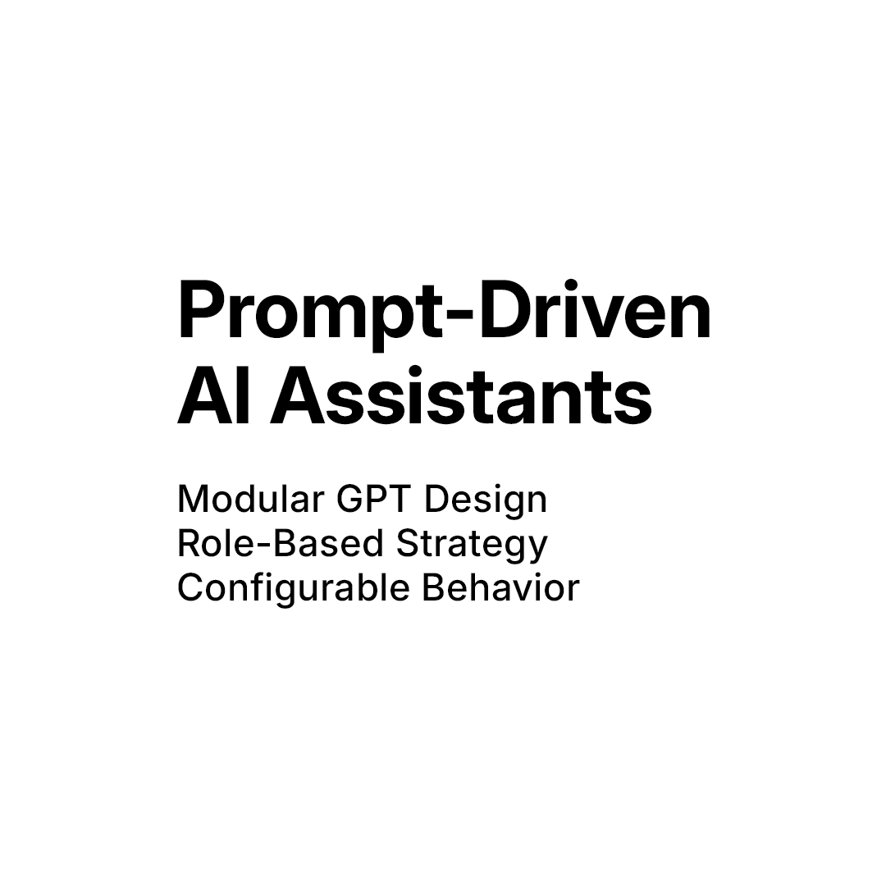

# 🧠 Design System for Role-Based AI Assistants



This repository offers a modular framework for building reusable, role-based AI assistants — each with a clear purpose, portable prompts, and structured behavior.

Each assistant is built using:

- 🔧 Structured Markdown instructions for assistant behavior  
- 🗂 Config files aligned with Custom GPT setup  
- 💬 Portable facing prompts for ChatGPT, Claude, Groq, etc.  
- 🛠 Tooling for syncing config, regenerating capabilities, and tracking changes  

---

## 📁 Current Assistants

### ✅ Professional Content Strategist

**This assistant helps professionals craft impactful social media content using one of three strategic modes — High Performance, Balanced Clarity, or Narrative Essence.**  
Each mode is tailored to different goals, audiences, and tones, using modern copywriting, storytelling, and prompt engineering techniques.

**Modes Overview:**
- **High Performance** — maximize reach and conversions  
- **Balanced Clarity** — deliver clear, professional insights  
- **Narrative Essence** — build emotional connection through story

**Folder:** `content-strategist/`  
Includes:

- `content-strategist-GPT.md` – Main behavior instructions  
- `content-strategist-facing-prompt.md` – Prompt to use across ChatGPT, Claude, etc.  
- `content-strategist-GPT-config.json` – Custom GPT configuration snapshot  
- `content-strategist-GPT-capabilities.md` – Auto-generated summary of tools and assistant behavior   

---

## 🛠 Tooling

### `update-gpt.ps1`

A PowerShell script to keep your assistant's `.json` config in sync with its Markdown instructions.

#### ✅ Features

- Escapes line breaks, backslashes, and quotes for JSON
- Preserves emoji and UTF-8 characters correctly
- Ensures all tool flags (`web_browsing`, `code_interpreter`, etc.) are present
- Generates a `*-capabilities.md` file summarizing model, tools, and assistant behavior
- Designed to run **from inside the assistant folder**

#### 📁 Expected Files (in the same folder):

- `[name]-GPT.md`  
- `[name]-GPT-config.json`

#### 🔧 Usage

```powershell
cd ./content-strategist
../tools/update-gpt.ps1

---

## 🚀 How to Use This Repo

| File                               | Purpose                                               |
|------------------------------------|-------------------------------------------------------|
| `[name]-GPT.md`                    | Full Custom GPT instructions                          |
| `[name]-facing-prompt.md`          | Reusable prompt for LLMs (ChatGPT, Claude, etc.)      |
| `[name]-GPT-config.json`           | Assistant configuration snapshot                      |
| `[name]-GPT-capabilities.md`       | Auto-generated summary of tools and behavior          |
| `tools/update-gpt.ps1`             | Markdown-to-JSON sync and capabilities generator      |
| `README.md`                        | Project overview and usage guide                      |
| *(optional)* `PROJECTS.md`         | Assistant ideas and drafts                            |

---

## ✅ Best Practices

1. **Edit in Markdown** — All assistant logic lives in `.md` for clarity and portability  
2. **Sync with PowerShell** — Run `update-gpt.ps1` to update `.json` and generate capabilities summary  
3. **Run from inside each assistant folder** — This keeps paths simple and structure consistent  
4. **Version manually or via Git** — Store assistants cleanly per folder to enable reuse and comparison  
5. **Don’t upload `.json` to the GPT builder** — Use it for backup, documentation, or recreation only

---

## 🧪 Prompt Tracking & Feedback Loops

To make assistants more adaptive over time, consider building in feedback loops:

- Track which prompt variations get better engagement, clarity, or creativity
- Use real-world signals like LinkedIn performance or team feedback
- Compare prompt versions via Git commits or changelogs
- Encourage testers or collaborators to give qualitative notes
- Update `.md` files based on actual results, not just assumptions

> This helps your assistant evolve from a static template into a testable, high-performance system.

---

## 📦 File Naming Pattern for Future Assistants

Use the same structure:

- `[name]-GPT.md`  
- `[name]-facing-prompt.md`  
- `[name]-GPT-config.json` 
- `[name]-GPT-capabilities.json`   

---

## 🧭 Topics & Focus

This project combines:

- 🧠 Prompt engineering  
- 🎛 Modular assistant design  
- 📎 Content creation strategy  
- 🛠 Custom GPT configuration  

Use this structure to build assistants like:

- Copywriters  
- Interviewers  
- Research planners  
- Content strategists  
- Creative collaborators  

---

## 🔗 Repo Metadata

**Title:** `prompt-driven-ai-assistants`  
**Topics:** `prompt-engineering`, `ai-assistants`, `custom-gpt`, `modular-design`, `role-based-ai`, `chatgpt`, `openai`

---

## ✅ Status

- [x] Folder structure complete  
- [x] First assistant implemented (Content Strategist)  
- [x] Markdown + JSON + tooling added  
- [ ] Second assistant in development  

---

## 📄 License

MIT — feel free to adapt, remix, or fork.

---

> Designed for creators, strategists, and AI builders who want more than just a clever prompt — a system that scales.
